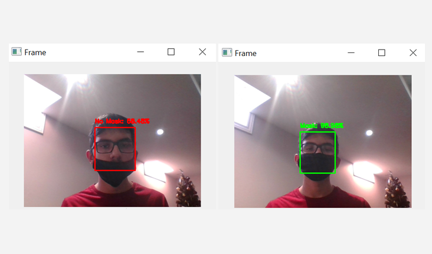

# Face Mask Detector

<p align="center"></p>

A convolutional neural network for detecting properly worn face masks.

Built using TensorFlow/Keras for the model and data augmentation, OpenCV with the HaarCascade Frontal Face model for demonstration, and Matplotlib for visualizing training results.

## About

The model consists of three convolutional layers with ReLU activation and max-pooling, followed by a fully connected dense layer with 512 neurons, a dropout layer for regularization, and a final dense layer with a softmax activation for binary classification (mask/no mask). It uses the Adam optimizer and binary cross-entropy as the loss function. The model achieves a validation accuracy of 94%.

## Setup

1. **Clone the repository:**
    ```bash
    git clone https://github.com/siddhp1/Face-Mask-Detector.git
    cd Face-Mask-Detector 
    ```

2. **Create the Conda environment:**
    ```bash
    conda env create -f face_mask_detector_env.yml
    ```

3. **Activate the Conda environment:**
    ```bash
    conda activate face_mask_env
    ```

## Usage

1. **Run the demo script:**

    ```bash
    cd demo
    python detect_mask.py
    ```

2. **Deactivate the Conda environment (after usage):**
    ```bash
    conda deactivate
    ```

## License

This project is licensed under the MIT License.
